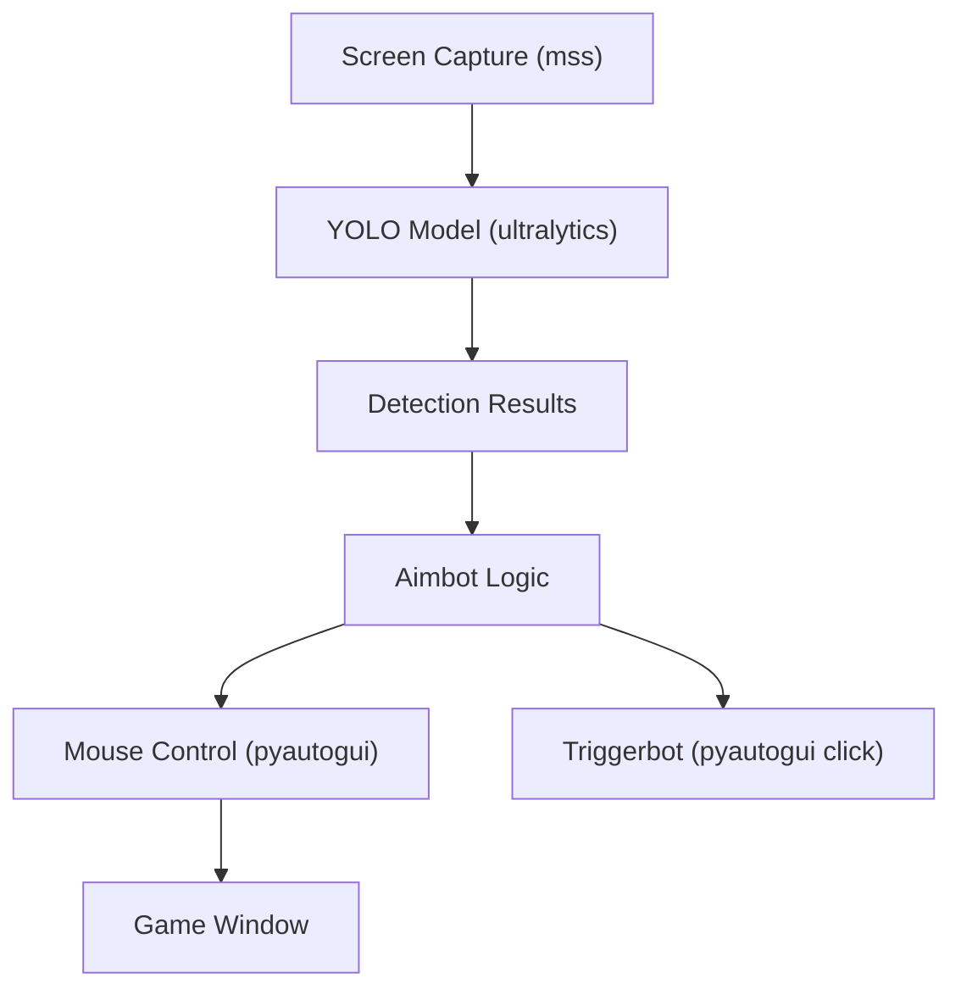
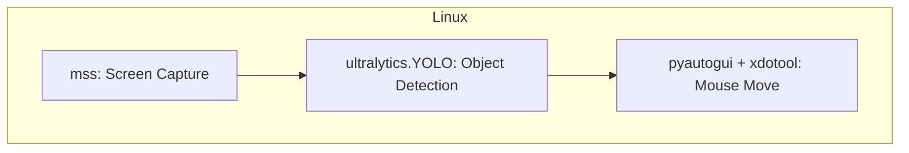
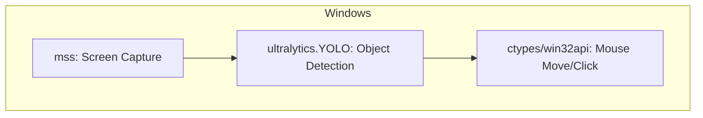

# AI-Aimbot (Linux Edition)

**This version is adapted for Linux by MelvinSGjr, based on the original [AI-Aimbot](https://github.com/xxreflextheone/AI-Aimbot) by [xxreflextheone](https://github.com/xxreflextheone).**
**Trigger bot is not working**

# 🧠 YoloV12 AI Aimbot - Lunar LITE

**Lunar LITE** is built on top of the original [Lunar](https://github.com/zeyad-mansour/lunar) project.

It features an updated triggerbot, modernized packages, and YOLOv12 support.

<div align="center">

<br>
<a href="https://discord.gg/aiaimbot">
  
</a>

</div>

---

## 🚀 Lunar V2 (Premium)

**Lunar V2** includes:

- ✅ 25+ customizable settings  
- ✅ Built-in UI  
- ✅ Improved detection accuracy  
- ✅ Supports **YOLOv8**, **YOLOv10**, **YOLOv12**, and **TensorRT**  
- ✅ Works on AMD and NVIDIA graphics cards

[Download Lunar V2](https://gannonr.com/lunar)


---

## ❓ What Is an AI Aimbot?

Lunar uses screen capture + YOLO object detection to locate enemies in real-time.

> It doesn't touch memory or inject code — think of it as a robot that watches your screen and gives you precise X,Y coordinates of targets.

🎯 Preconfigured for **Fortnite** (That will not run on Linux) — some sensitivity tuning may be needed for other games.

> **Note:** For Wayland (e.g., GNOME, KDE), pyautogui may not work fully — this is a limitation of the system itself. In this case, try running under an X11 session or use alternative libraries (such as xdotool via subprocess).

---

## 🔧 YOLOv12 Support

Lunar LITE works with:
- [YOLOv8](https://github.com/ultralytics/ultralytics)
- [YOLOv10](https://github.com/ultralytics/ultralytics)
- [YOLOv12](https://github.com/ultralytics/ultralytics)

---


---

<details>
<summary>📦 <strong>Installation</strong></summary>

1. Install [Python 3.10.5](https://www.python.org/downloads/release/python-3105/)
2. Install **CUDA Toolkit** 11.8, 12.4, or 12.6 (**12.6 recommended**)
3. Navigate to the root folder and run:
    ```
    install_requirements.bat
    ```
4. Launch with:
    ```
    start.bat
    ```

</details>

---

<details>
<summary>⚙️ <strong>Usage / Troubleshooting</strong></summary>

### If you get `CUDA IS UNAVAILABLE` error:
1. Make sure your installed CUDA version matches.
2. Visit [pytorch.org](https://pytorch.org/get-started/locally/) and install the right build.

Command for CUDA 12.6:
```
pip3 install torch torchvision torchaudio --index-url https://download.pytorch.org/whl/cu126
```

---

### If the console closes instantly:
```
python lunar.py
```

---

### To configure sensitivity:
```
python lunar.py setup
```

---

### To collect training images:
```
python lunar.py collect_data
```

</details>

---

## 💬 Discord Support

Support is only **guaranteed** for **Lunar V2**.  
Please don't expect full help for the free **LITE** version.

👉 [Join our Discord](https://discord.gg/aiaimbot)

## How to run on Linux

1. Install requirements:
   ```sh
   chmod +x install_requirements.sh start.sh
   ./install_requirements.sh
   ./start.sh
   ```
2. Start the aimbot:
   ```sh
   chmod +x start.sh
   ./start.sh
   ```

## Architecture Overview

Below are diagrams showing how the aimbot works on Linux and Windows:

### General Flow



### Linux Implementation



### Windows Implementation



## Linux Mouse Control

On Linux, all mouse movement and clicks are handled by the [pyautogui](https://pyautogui.readthedocs.io/en/latest/) library, which is cross-platform and does not require any DLLs or native extensions. The `xdotool` replaces the Windows-only ddxoft DLL and win32api/ctypes logic.

- **No DLLs or Windows binaries are required.**
- All mouse actions are simulated at the OS level and work in any X11/Wayland environment.

> Optionally, you can add your own short .wav files to the `lib/` directory with the names `aim_on.wav` and `aim_off.wav` to enable sound notifications when the aimbot is enabled or disabled. If these files are not present, the aimbot will work silently.

## Linux Mouse Control (X11)

- On Linux (X11), mouse movement is performed using [xdotool](https://github.com/jordansissel/xdotool), which allows for reliable mouse control in most games.
- Install xdotool with:
  ```sh
  sudo apt install xdotool   # Debian/Ubuntu
  # or
  sudo pacman -S xdotool     # Arch/EndeavourOS
  ```
- If xdotool is not installed, the aimbot will not be able to move the mouse in games.
- **Note:** pyautogui does not work in fullscreen games or with raw input. xdotool is required for proper mouse movement in shooters.
